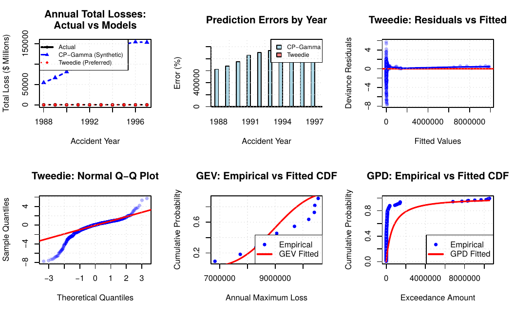

# Aggregate Loss Modeling: Tweedie vs Synthetic Exposure

[](https://www.linkedin.com/in/andrew-nelson-)
[](https://opensource.org/licenses/MIT)
[](https://www.r-project.org/)

> **TL;DR:** Synthetic exposure assumptions produce **905,421% error**. Tweedie modeling achieves **5.12% error**. This 177,000× difference shows why matching methods to available data beats forcing traditional approaches with unverified assumptions.

---

## 📊 The Finding

| Approach | Assumptions | MAE | Verdict |
|----------|-------------|-----|---------|
| **Compound Poisson-Gamma** | Synthetic exposure + claims | 905,421% | ❌ Fails catastrophically |
| **Tweedie Distribution** | None (models aggregates directly) | 5.12% | ✅ Reliable |

## 🎯 What This Project Demonstrates

A rigorous comparative analysis showing why **appropriate methodology matters more than theoretical tradition** when facing data constraints in actuarial modeling.

### The Problem
CAS Schedule P provides aggregate losses and premium but lacks:
- Exposure counts (car-years, policies)
- Claim-level data
- Individual severities

These are **required inputs** for traditional frequency/severity decomposition.

### Three-Part Analysis

**Part 1: Compound Poisson-Gamma (Methodological Demonstration)**
- Uses synthetic exposure: `Premium / $1,000`
- Uses synthetic claims: `Loss / $5,000`
- Result: **905,421% MAE** → Catastrophic failure ❌

**Part 2: Tweedie Distribution (Recommended Approach)**
- Models aggregate losses directly
- No synthetic assumptions needed
- Result: **5.12% MAE** → Reliable estimates ✅

**Part 3: Extreme Value Theory**
- GEV (block maxima): Bounded industry risk (ξ = -0.33)
- GPD (threshold exceedances): Heavy-tailed company extremes (ξ = 0.82)
- Complementary perspectives on tail risk

---

## 📈 Key Results

### Tweedie Model (Preferred)
- **Power parameter (p) = 1.762** → Severity-dominated losses
- **Annual trend = -2.74%/year** (1988-1997 historical period)
- **Premium elasticity = 1.024** → Near-proportional scaling
- **Pseudo R² = 0.9766** → Excellent fit (97.7% deviance explained)

### Extreme Value Analysis
- **GEV shape (ξ) = -0.33** → Industry maxima bounded at ~$11.7M
- **GPD shape (ξ) = 0.82** → Individual extremes heavy-tailed (infinite variance)
- **100-year return levels**: $11.0M (GEV) vs $6.5M (GPD)
- Different tail behaviors reflect diversification vs. concentration risk

---

## 📊 Visualizations

The analysis produces comprehensive visualizations comparing model performance and diagnostics:



*Figure: Six-panel diagnostic visualization showing (1) Annual total losses comparison, (2) Prediction errors by year, (3-4) Tweedie model diagnostics (residuals, Q-Q plot), (5-6) Extreme value theory fits (GEV for annual maxima, GPD for threshold exceedances)*

**Key Insights from Visualizations:**
- CP-Gamma predictions wildly miss actual losses (top-left)
- Tweedie predictions closely track reality with consistent small errors
- Model residuals show good distributional properties
- EVT models capture tail behavior effectively

---

## 📥 Full Documentation

**[📄 Download Complete PDF Report](reports/Benefits_of_using_synthetic_exposure_data_for_frequency_and_severity_analysis.pdf)**

The 9-page academic report includes:
- Detailed methodology and mathematical formulation
- Complete statistical results with significance tests
- Model diagnostics and goodness-of-fit measures
- Reconciliation of divergent EVT shape parameters
- Discussion of limitations and historical context
- Comprehensive references

---

## 🚀 Quick Start

### Prerequisites
```r
install.packages(c("tidyverse", "MASS", "tweedie", "statmod", "evd"))
```

### Run the Analysis
```bash
# Clone repository
git clone https://github.com/drewnelson2223-lgtm/9000000_MAE.git
cd 9000000_MAE

# Execute complete pipeline
Rscript run_analysis.R
```

### Expected Output
```
📊 DATA:
   - Source: CAS Schedule P Personal Auto Bodily Injury
   - Company-year observations: 1166
   - Accident years: 1988-1997
   - Companies: 144

✅ PART 2: TWEEDIE MODELING (PREFERRED APPROACH)
   - Power parameter (p): 1.762
   - Mean Absolute Error: 5.12%
   ✅ RECOMMENDED for actual estimates
```

---

## 💡 Why This Matters

### Methodological Lesson
When facing missing data:
1. ✅ **Adapt methods to available data**
2. ❌ **Don't force traditional approaches with synthetic assumptions**

This principle generalizes beyond insurance to **any analytical domain with data constraints**.

### Practical Applications

**Use Tweedie when:**
- Modeling aggregate losses without exposure/claim counts ✅
- Working with CAS Schedule P or similar aggregate data ✅
- Premium is available but detailed breakdowns are not ✅

**Use Compound Poisson-Gamma when:**
- You have actual exposure data (car-years, policies) ⚠️
- Individual claim counts are available ⚠️
- Synthetic assumptions are NOT acceptable ⚠️

---

## 📁 Repository Structure

```
9000000_MAE/
├── src/                          # Modular analysis scripts
│   ├── 01_data_prep.R           # Data loading and preparation
│   ├── 02_cp_gamma_synth.R      # CP-Gamma with synthetic exposure
│   ├── 03_Tweedie_modeling.R    # Tweedie GLM fitting
│   ├── 04_EVT_analysis.R        # Extreme value theory (GEV + GPD)
│   ├── 05_comparison_visualization.R  # Model comparison and plots
│   └── utils.R                  # Helper functions
├── reports/                      # Output documentation
│   ├── Benefits_of_using_synthetic_exposure_data.pdf
│   └── figures/
│       ├── visualization.png
│       └── (additional diagnostic plots)
├── results/                      # Saved model objects
│   ├── base_data.rds
│   ├── tweedie_results.rds
│   ├── evt_results.rds
│   └── model_comparison.csv
├── data/                         # Auto-downloaded from CAS
├── run_analysis.R               # Master pipeline script
└── README.md                    # This file
```

---

## 📊 Data Source

**Source:** [CAS Schedule P - Personal Auto Bodily Injury](https://www.casact.org/sites/default/files/2021-04/ppauto_pos.csv)
- **Period:** 1988-1997 (10 accident years)
- **Companies:** 144 unique insurers
- **Observations:** 1,166 company-years
- **Note:** Historical data used for methodological demonstration; comparative insights remain valid

---

## 🔬 Methodology Summary

### Tweedie GLM Specification
```
Loss ~ Tweedie(μ, φ, p)

log(μ) = β₀ + β₁·Year + β₂·log(Premium)

where:
  - μ = expected aggregate loss (modeled via GLM)
  - φ = dispersion parameter
  - p = power parameter (1 < p < 2)
    → p ≈ 1.5: balanced frequency/severity
    → p > 1.7: severity-dominated (our case)
```

### Extreme Value Theory
- **GEV (Generalized Extreme Value):** Annual maximum losses per company
- **GPD (Generalized Pareto):** Exceedances above 85th percentile
- **Return Levels:** 10, 20, 50, 100-year estimates for capital planning

---

## 📚 Key References

1. Jørgensen, B., & Paes De Souza, M. C. (1994). *Fitting Tweedie's compound Poisson model to insurance claims data*. Scandinavian Actuarial Journal, 1994(1), 69-93.

2. Embrechts, P., Klüppelberg, C., & Mikosch, T. (1997). *Modelling Extremal Events for Insurance and Finance*. Springer.

3. Klugman, S. A., Panjer, H. H., & Willmot, G. E. (2012). *Loss Models: From Data to Decisions* (4th ed.). Wiley.

4. Dunn, P. K., & Smyth, G. K. (2018). *Generalized Linear Models With Examples in R*. Springer.

---

## 📞 Contact & Connect

**Andrew Nelson**

[](https://www.linkedin.com/in/andrew-nelson-)
[](https://github.com/drewnelson2223-lgtm)
[](mailto:drewnelson2223@gmail.com)

---

## 🎓 Academic Context

This project demonstrates graduate-level actuarial competency in:
- **Statistical Modeling:** GLMs, Tweedie distributions, profile likelihood
- **Extreme Value Theory:** GEV and GPD applications to insurance
- **Methodological Rigor:** Comparative analysis, diagnostic testing
- **Professional Communication:** Academic writing, data visualization

**Suitable for:**
- CAS Student Paper Competition submissions
- Actuarial job portfolio demonstrations
- Graduate coursework in predictive modeling
- Research on aggregate loss modeling techniques

---

## 📖 Citation

If you use this work or methodology, please cite:

```bibtex
@techreport{nelson2026aggregate,
  title={Aggregate Loss Modeling: Tweedie vs Synthetic Exposure},
  author={Nelson, Andrew},
  year={2026},
  institution={Independent Research},
  url={https://github.com/drewnelson2223-lgtm/9000000_MAE}
}
```

---

## 🤝 Contributing

Contributions are welcome! Areas for enhancement:
- [ ] Update analysis with 2010-2024 CAS data
- [ ] Add cross-validation framework
- [ ] Implement bootstrapped confidence intervals
- [ ] Develop interactive Shiny dashboard
- [ ] Extend to other CAS Schedule P lines (commercial auto, workers comp)

**Please open an issue to discuss proposed changes before submitting PRs.**

---

## 📄 License

This project is licensed under the **MIT License** - see the [LICENSE](LICENSE) file for details.

---

## 🏆 Acknowledgments

- **Casualty Actuarial Society** for providing Schedule P data
- **Tweedie package authors** (Dunn & Smyth) for statistical implementation
- **EVD package authors** for extreme value tools
- Actuarial community for feedback and methodology refinement

---

<p align="center">
  <strong>Demonstrating that methodological rigor > theoretical tradition</strong><br>
  <sub>When data constraints exist, adapt your methods—don't force unverified assumptions</sub>
</p>

<p align="center">
  <a href="https://www.linkedin.com/in/andrew-nelson-">
    
  </a>
</p>
